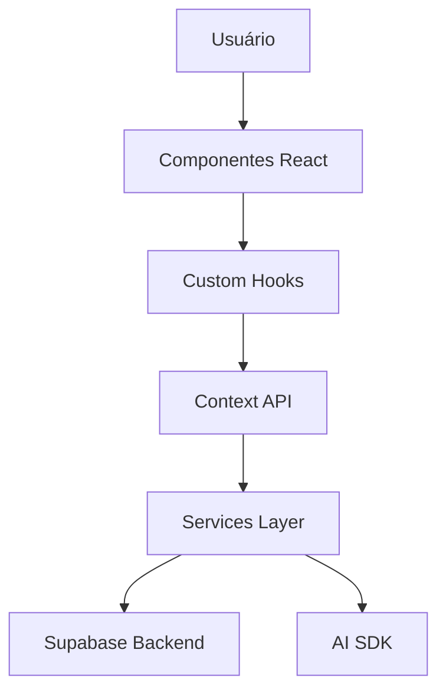
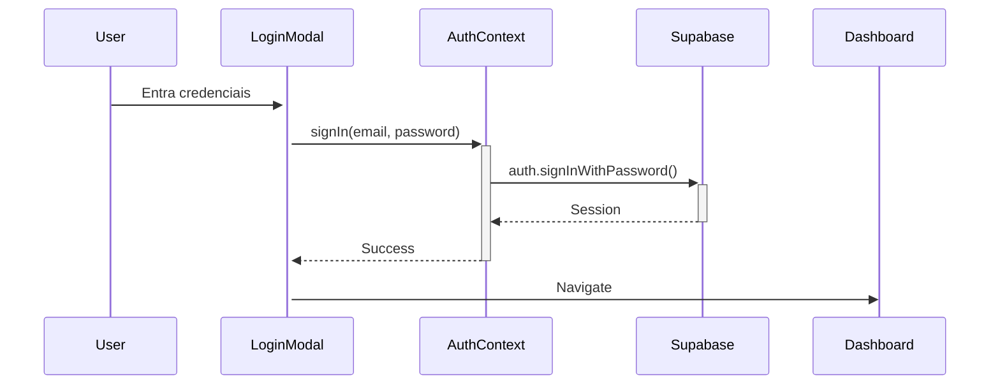
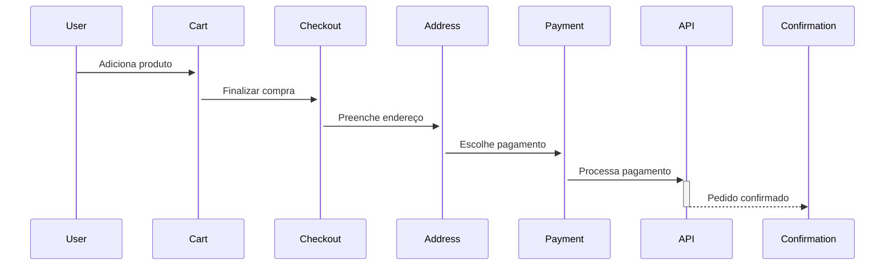

# 🏗️ Arquitetura - Ly Vest E-commerce

## Visão Geral

Ly Vest é um e-commerce de moda íntima feminina construído com arquitetura moderna, focado em performance, escalabilidade e experiência do usuário.

## Stack Tecnológica

| Camada | Tecnologia |
|--------|------------|
| **Frontend** | React 18 + TypeScript |
| **Build** | Vite 7 |
| **Styling** | TailwindCSS 3.4 |
| **Routing** | React Router DOM 6 |
| **State** | React Context API |
| **Backend** | Supabase (Auth + Database) |
| **AI** | AI SDK (OpenAI) |
| **Deploy** | Vercel |

---

## Estrutura de Diretórios

```
src/
├── components/           # Componentes React
│   ├── checkout/         # Fluxo de checkout
│   ├── dashboard/        # Painel do usuário
│   ├── features/         # Features avançadas (AI, Chat)
│   ├── layout/           # Layout (Header, Footer, etc)
│   ├── modals/           # Modais do sistema
│   ├── product/          # Componentes de produto
│   └── ui/               # Componentes base (Skeleton, etc)
├── context/              # Contexts (Auth, Cart, Modal, etc)
├── hooks/                # Custom hooks
├── pages/                # Páginas da aplicação
├── services/             # Serviços (API, Payment, etc)
├── data/                 # Dados mockados
└── utils/                # Utilitários
```

---

## Fluxo de Dados



---

## Contextos Principais

| Context | Responsabilidade |
|---------|------------------|
| `AuthContext` | Autenticação e sessão do usuário |
| `CartContext` | Gerenciamento do carrinho |
| `FavoritesContext` | Lista de favoritos |
| `ModalContext` | Controle de modais |
| `I18nContext` | Internacionalização (PT, EN, ES) |
| `ShopContext` | Estado global da loja |

---

## Padrões de Design

### Component Patterns
- **Compound Components**: Modais com subcomponentes
- **Render Props**: Hooks que retornam UI
- **Container/Presentational**: Separação de lógica e apresentação

### State Management
- **Context + useReducer**: Para estados complexos
- **localStorage**: Persistência de carrinho e favoritos
- **React Query patterns**: Cache e sincronização

### Error Handling
- **ErrorBoundary**: Catch de erros React
- **Try/Catch**: Operações assíncronas
- **Toast notifications**: Feedback ao usuário

---

## Performance

### Code Splitting
- Lazy loading para páginas secundárias
- Dynamic imports para features pesadas (ChatWidget, AI)

### Otimizações
- `React.memo()` para componentes puros
- `useMemo` e `useCallback` para evitar re-renders
- Debounce na busca
- Virtualização para listas longas

### Bundle
- Chunks separados: vendors, icons, AI, Supabase
- Tree shaking habilitado
- Console removal em produção

---

## Segurança

| Medida | Implementação |
|--------|---------------|
| XSS | DOMPurify para sanitização |
| CSRF | Tokens em formulários |
| Rate Limiting | Limitação de requisições |
| CSP | Headers configurados |
| Input Validation | Zod schemas |

---

## Testes

### Unit Tests (Vitest)
```bash
npm run test
```

### E2E Tests (Playwright)
```bash
npm run test:e2e
```

### Cobertura
```bash
npx vitest run --coverage
```

---

## Deploy

### Produção (Vercel)
- Push para `main` → Deploy automático
- Preview para PRs

### Variáveis de Ambiente
```env
VITE_SUPABASE_URL=
VITE_SUPABASE_ANON_KEY=
OPENAI_API_KEY=
```

---

## Diagramas

### Fluxo de Autenticação


### Fluxo de Checkout


---

*Documentação gerada em 01/02/2026*
